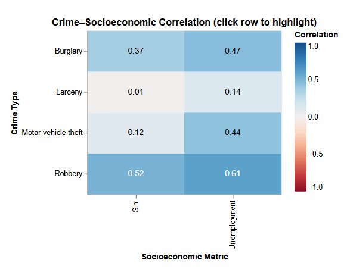
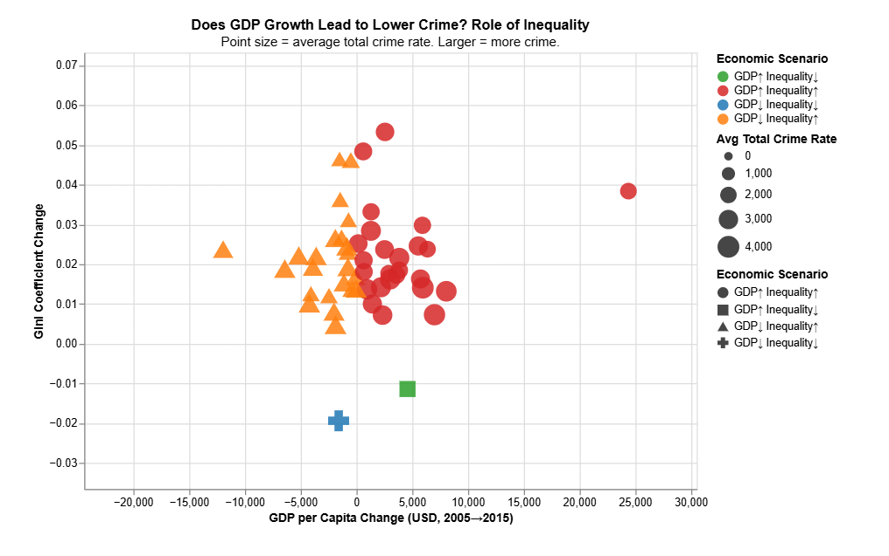
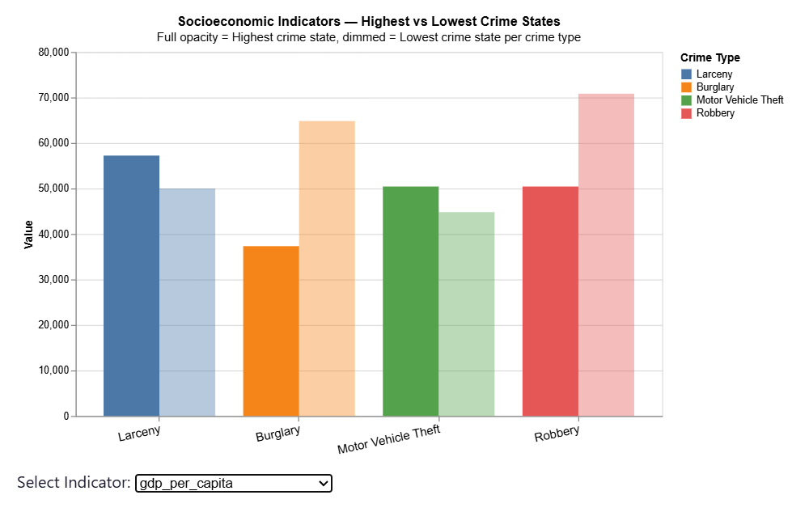

# 📊 Economic Data Visualization and Exploratory Analysis

## Overview

This project demonstrates the application of data visualization and exploratory data analysis (EDA) techniques to analyze economic data using Python. By transforming raw datasets into meaningful visual representations, the project identifies trends, distributions, correlations, and patterns that support data-driven analysis.

The project follows a structured data analytics workflow consisting of data preprocessing, exploratory analysis, statistical visualization, and interpretation of results. It showcases fundamental data analysis skills that serve as the foundation for more advanced machine learning and artificial intelligence workflows.

---

## Objectives

- Clean and preprocess raw economic data.
- Perform Exploratory Data Analysis (EDA).
- Explore statistical distributions and relationships between variables.
- Identify trends, correlations, and potential outliers.
- Communicate insights using effective data visualizations.
- Develop reproducible data analysis workflows using Python.

---

## Dataset

The project analyzes an economic dataset containing multiple quantitative variables used for exploratory analysis and visualization.

**Dataset includes variables such as:**

- Gross Domestic Product (GDP)
- Inflation
- Unemployment
- Population
- Other macroeconomic indicators (where applicable)

> **Note:** Replace this section with the exact dataset name and source used in the project (e.g., World Bank, OECD, Kaggle).

---

## Technologies Used

- Python
- Jupyter Notebook
- Pandas
- NumPy
- Matplotlib
- Seaborn

---

## Project Workflow

1. Import the dataset.
2. Inspect the dataset.
3. Clean and preprocess the data.
4. Handle missing values and inconsistencies.
5. Perform Exploratory Data Analysis (EDA).
6. Generate descriptive statistics.
7. Create visualizations.
8. Interpret analytical findings.

---

## Visualizations

The project includes several visualization techniques, including:

- Histograms
- Bar Charts
- Scatter Plots
- Box Plots
- Line Charts
- Correlation Heatmaps
- Pair Plots
- Distribution Plots

These visualizations are used to examine:

- Variable distributions
- Relationships between features
- Correlations
- Trends
- Category comparisons
- Outlier detection

---

## Results

Representative outputs from the analysis include:

- Correlation Heatmaps
- Distribution Visualizations
- Scatter Plot Analysis
- Comparative Bar Charts


Example:

## Results

The analysis produced several visual outputs highlighting patterns, relationships, and trends within the dataset.

### Correlation Heatmap



### Distribution Analysis



### Feature Relationship Analysis



---

## Key Findings

The exploratory analysis enables the identification of:

- Statistical distributions of economic variables.
- Relationships between multiple indicators.
- Correlations across numerical features.
- Potential outliers requiring further investigation.
- Overall trends present within the dataset.

---

## Skills Demonstrated

- Data Cleaning
- Data Preprocessing
- Exploratory Data Analysis (EDA)
- Statistical Analysis
- Data Visualization
- Correlation Analysis
- Feature Exploration
- Python Programming
- Pandas
- NumPy
- Matplotlib
- Seaborn
- Analytical Thinking
- Data Interpretation

---

## Repository Structure

```
Data-Visualization-Project/
│
├── data/                 # Dataset(s)
├── notebooks/            # Analysis notebooks
├── images/               # Visualization outputs
├── requirements.txt      # Project dependencies
└── README.md
```

---

## Installation

Clone the repository:

```bash
git clone https://github.com/pereramanuth/Data-Visualization-Project.git
```

Navigate to the project directory:

```bash
cd Data-Visualization-Project
```

Install the required packages:

```bash
pip install -r requirements.txt
```

Launch Jupyter Notebook:

```bash
jupyter notebook
```

---

## Future Improvements

Potential extensions include:

- Interactive visualizations using Plotly.
- Dashboard development with Streamlit.
- Automated analytical reporting.
- Additional datasets for comparative studies.
- Advanced statistical analysis.
- Time-series forecasting and predictive analytics.

---

## Author

**Manuth Perera**

Bachelor of Science in Applied Artificial Intelligence Solutions  
University of Applied Sciences Upper Austria (FH Oberösterreich) – Hagenberg Campus

GitHub: https://github.com/pereramanuth

---

## License

This project is licensed under the MIT License.
